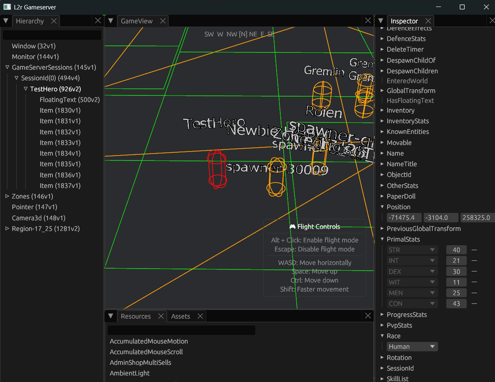

# 🎮 Game Server & World Simulation


<p align="center">
    
</p>

---

## ★ **Bevy ECS Game Engine**
- **Plugin Architecture** - Modular game systems with dependency injection and hot-swappable components
- **Entity Management** - Efficient component storage with query optimization for thousands of entities

## ★ **Object Identity & Persistence System**
- **ObjectId Manager** - Unique ID assignment with BitSet optimization and prime-number-based capacity scaling
- **Database Persistence** - Object IDs persist across server restarts, maintaining world state continuity
- **Entity-ObjectId Mapping** - Bi-directional lookup system for fast entity queries by ObjectId
- **ID Range Management** - Reserved ID ranges (u16::MAX*4 to i32::MAX) with collision-free allocation

## ★ **Encounter & Visibility System**  
- **KnownEntities Tracking** - Each player entity maintains a HashSet of visible entities within interaction range
- **Distance-Based Visibility** - Automatic encounter detection/removal based on configurable distance thresholds  
- **Real-time Updates** - Configurable update cycle for encounter management with minimal performance overhead
- **Network Packet Generation** - Automatic CharInfo/NpcInfo/SpawnItem packet sending when entities become visible, and DeleteObject packet to cleanup when out of range or despawned.

## ★ **Spatial Systems & L2J Geodata**
- **L2J Geodata Format** - Full support for L2J `.l2j` geodata files with height detection and pathfinding cells
- **A\* Pathfinding** - Real pathfinding implementation with geodata validation and movement cost calculation
- **Region-Based World** - Implemented regions with dynamic loading/unloading based on online player presence in current region.
- **Bevy Relationship System** - Custom `DespawnChildOf` hierarchy for automatic cleanup of regional entities
- **Memory Management** - Automatic region despawning when no players online, freeing NPCs and items via `DespawnChildren`
- **3D Physics Integration** - `avian3d` physics engine with collision detection and spatial queries (now using colliders only, to build zones and players/npcs capsules for debug-GUI)

## ★ **Character & Stats System**
- **L2 Classic Stats** - Full STR/DEX/CON/INT/WIT/MEN implementation with racial bonuses and equipment modifiers
- **Dynamic Stat Calculation** - Real-time stat computation from base stats + equipment + abnormals + modifiers
- **Class Tree System** - RON-based class progression data with skill prerequisites and stat requirements
- **Race Stats Integration** - Racial stat modifiers and bonuses loaded from game data files

## ⚡ **NPC & Spawning Framework**
- **Spawn System** - JSON-based NPC spawn data with regional loading and despawning
- **Basic AI States** - Monster AI with attack-back and basic sneaking-around patterns
- **Regional NPCs** - NPCs tied to regions via `DespawnChildOf` for automatic cleanup

## ⚡ **Combat System**
- **Physical Damage** - P.Atk calculation with critical hits, shield blocking, and weapon-based formulas
- **Hit/Miss Calculation** - Accuracy vs evasion calculations.
- **Attack Animation** - Basic attack sequences with animation timers and locks using bevy components.
- **Combat State Management** - CP/HP/MP damage/restoration, death and revive mechanics
- **Soulshot Integration** - Partial shot consumption mechanics for enhanced damage (+basic implementation of auto-use)

## ⚡**Item System & Equipment**
- **JSON Item Database** - Items definitions with stats, grades, and properties
- **Paper Doll System** - Equipment slots with stat calculation and visual updates
- **Inventory Management** - Inventory updates, can pickup, store, drop, destroy items.

## ⚡ **Lua Scripting & Runtime System**
- **RuntimeScript Architecture** - Hot-loadable `app.lua` entry points in `data/scripts/runtime/` directories
- **LuaApp/LuaPlugin Framework** - Bevy-inspired modular plugin system with dependency injection and lifecycle hooks
- **Type Annotations (LuaCATS)** - Type definitions using for IDE autocomplete and type checking
- **Hot-Reloading** - `req()` alias for `require()` that clears module cache, enabling live code updates during development
- **Skills Plugin System** - Complete skill system implemented as LuaPlugin with storage, casting, and packet handling modules

## ⚡ **Game Mechanics & Systems**
- **Skills Framework** - Skills partially implemented via Lua scripting with plugin architecture, casting mechanics, buffs/debuffs, stat modifiers, damage/restoration over time, passive skills
- **Movement System** - Pathfinding integration with geodata validation and obstacles detection (I hope we cant run through walls)
- **Teleportation** - Basic NPC-based (Gatekeepers) teleport system with location validation (some restrictions TODO)
- **Chat System** - Basic say/shout/private implementation with range validation and player lookup with logging into files.
- **Administrative Commands** - Use //admin in chat to observe HTML admin menu. Basic GM teleport, item\npc spawning and so on.
- **Admin Item Shop** - Generated from item assets info, allows administrators to spawn any available item directly to inventory
- **NPC Inspection System** - Action packet with Shift+Click functionality displays NPC stats in HTML dialog

## 🔨 **MMO Features (Dreams)**
- **Guild/Clan Management** - Database schema might exist but no gameplay mechanics
- **PvP & Karma System** - Combat system exists but no PvP rules or penalties
- **Trading & Auction** - Basic item framework but no player-to-player trading mechanics
- **Quest Engine** - Lua scripting support for complex quest chains with branching narratives
- **Guild Warfare** - Alliance systems, territory control, and large-scale PvP mechanics  
- **Economic Systems** - Auction, crafting economy, and player-driven market dynamics
- **Siege Warfare** - Castle ownership with scheduled battles and political mechanics
- **Crafting Mastery** - Multi-tier crafting with rare materials, failure chances, and masterwork items

---

*Legend: ★ = Almost working | ⚡ = In Development | 🔨 = Dreams*

---

## 📜 **Lua Scripting System**

### **RuntimeScript Architecture**
The game server supports a modular Lua scripting system that loads automatically on startup. Scripts are organized in `game_server/data/scripts/runtime/` directories, with each module having an `app.lua` entry point.

**Key Features:**
- **Automatic Loading** - All `app.lua` files in `runtime/` subdirectories are discovered and loaded at server startup
- **Hot-Reloading** - Use `req()` instead of `require()` for development hot-reloading of Lua modules
- **Type Safety** - LuaCATS annotations provide IDE autocomplete and type checking
- **Plugin Architecture** - Modular system inspired by Bevy's plugin design

### **LuaApp & LuaPlugin System**

The scripting framework follows Bevy's plugin architecture for organizing game logic:

**LuaApp** - Application container that manages plugin lifecycle:
```lua
local app = LuaApp:new("MyApp")
app:add_plugins({ MyPlugin })
app:initialize()
```

**LuaPlugin** - Modular components with dependency injection:
```lua
---@class MyPlugin : LuaPlugin
local MyPlugin = LuaPlugin:new("MyPlugin")

function MyPlugin:build(app)
    -- Load modules and services
    self.storage = req("path.to.storage")
end

function MyPlugin:on_load(app)
    -- Initialize after all dependencies loaded
end
```

**Plugin Features:**
- **Dependencies** - Plugins can declare dependencies for load ordering
- **Lifecycle Hooks** - `on_load()`, `on_unload()`, `on_enable()`, `on_disable()`
- **Nested Plugins** - Plugins can contain child plugins for better organization
- **Priority System** - Fine-grained load ordering within dependency levels

### **LuaCATS Type Annotations**

All scripts use LuaCATS (Lua Comment And Type System) for type safety and IDE support:

```lua
---@class MyComponent
---@field value number The numeric value
---@field name string The component name

---@param entity Entity The target entity
---@param value number The value to set
---@return boolean success Whether operation succeeded
function set_component_value(entity, value)
    -- Implementation with full type checking
end
```

**Available Type Definitions:**
- `game_server/data/scripts/types.lua` - Core game types (Entity, Transform, Stats, etc.)
- `game_server/data/scripts/runtime/skills/types.lua` - Skill-specific types

### **Hot-Reloading with `req()`**

The `req()` function enables module hot-reloading during development:

```lua
-- Hot-reloadable (recommended for development)
local Magic = req("data.scripts.runtime.skills.definitions.common.Magic")

-- Standard (cached, requires server restart)
local Magic = require("data.scripts.runtime.skills.definitions.common.Magic")
```

**How it works:**
- `req()` clears the module from Lua's package cache before loading
- Changes to common modules take effect immediately
- Ideal for iterative development without server restarts

---

##  **Adding New Lua Skills**

### **Overview**
Skills are managed by the **SkillsApp** runtime script, which automatically loads skill definitions. The plugin architecture handles skill storage, casting mechanics, and packet processing.

### **Prerequisites**
- Skills are located in `game_server/data/scripts/runtime/skills/definitions/`
- Each skill is a `.lua` file named by skill ID (e.g., `77.lua` for skill ID 77)
- Common functionality is in `definitions/common/` folder
- The SkillApp automatically loads all skill files on server startup

### **Step 1: Choose Your Base Skill**
Copy an existing skill file that's similar to what you want to create:
- **Buff Skills**: `77.lua` (Attack Aura) - self-targeting stat boost
- **Attack Skills**: `142.lua` or `16.lua` - offensive abilities  
- **Magic Skills**: Skills using `Magic.lua` for magical effects

### **Step 2: Create Your New Skill File**
```bash
# Copy existing skill as template
cp game_server/data/scripts/runtime/skills/definitions/77.lua `
   game_server/data/scripts/runtime/skills/definitions/YOUR_SKILL_ID.lua
```

### **Step 3: Define Skill Structure**

Skills follow a **SkillHandler** pattern with type annotations:

```lua
require("data.scripts.Utils")
local Magic = req("data.scripts.runtime.skills.definitions.common.Magic")
local Target = req("data.scripts.runtime.skills.definitions.common.Target")
local AbnormalEffects = req("data.scripts.game.AbnormalEffects")

---@type SkillDefinition
local definition = {
    id = YOUR_SKILL_ID,           -- Must match filename!
    levels = 2,                   -- Number of skill levels
    name = "Your Skill Name",
    description = "Skill description here",
    kind = "Active",              -- "Active", "Passive", or "Toggle"
    tables = {
        abnormalLevels = { 1, 2 },
        effectPoints = { 138, 268 },    -- Damage/healing per level
        magicLevel = { 10, 28 },        -- Required magic level
        mpConsume = { 5, 10 },          -- MP cost per level
        mpInitialConsume = { 2, 3 },    -- Initial MP cost per level
        stats = {                       -- Stat modifications
            PAtk = { "Mul", { 1.08, 1.12 } },  -- Multiply P.Atk by values
            -- Available stats: PAtk, MAtk, PDef, MDef, Speed, etc.
            -- Modes: "Add" (flat bonus), "Mul" (percentage), "Sub" (reduction)
        }
    },
    other = {
        abnormalTime = 1200000,     -- Effect duration (milliseconds)
        abnormalKind = "PaUp",      -- Abnormal effect type
        castRange = 0,              -- Casting range (0 = self)
        effectRange = 0,            -- Effect range
        hitTime = 4000,             -- Cast time (milliseconds)
        reuseDelay = 2000,          -- Cooldown (milliseconds)
        icon = "icon.skill0077",    -- UI icon
        isMagic = true,             -- Is this a magic skill?
        targetType = "Self",        -- "Self", "Enemy", "Friend", etc.
        priority = 2                -- Abnormal effect priority
    },
}

---@type SkillHandler
local Skill = {
    definition = definition,
    
    -- Called when player initiates skill use
    pend = function(entity, skill_ref, shift_pressed, ctrl_pressed)
        Target.pend_on_self(entity, skill_ref)
        -- Or: Target.pend_on_target(), Target.pend_on_enemy()
    end,
    
    -- Called when skill casting begins
    on_pending = function(entity, pending_skill)
        Magic.on_pending_skill(entity, pending_skill, definition)
    end,
    
    -- Called when skill is launched
    launch = function(entity, target_entity, skill_ref)
        Magic.launch_buff_skill(entity, target_entity, skill_ref, definition)
        -- Or: Magic.launch_damage_skill()
    end,
    
    -- Called when abnormal effect is applied
    apply_abnormal = function(target_entity, skill_ref)
        AbnormalEffects.apply_stat_modifiers(target_entity, definition, skill_ref.level._1)
    end,
}

return Skill
```

### **Step 6: Testing Your Skill**
1. **Save app.lua** -  Even if you change some sub-modules, need to change 'entrypoint' script to trigger reload.
2. **Check server logs** - Verify SkillsApp loaded without errors
3. **Add skill to character** - Use admin menu (`//admin`) 
4. **Test in-game** - Cast skill, verify effects and stat changes

**How it works:**
1. Server loads `runtime/skills/app.lua` on startup
2. `app.lua` creates LuaApp and registers SkillsPlugin
3. SkillsPlugin loads storage, casting, and packet modules, spawns systems.
4. Skills are lazy-loaded from `definitions/` when first accessed
5. Game callbacks send from Rust (ex. `on_packet_received`) route through SkillsPlugin

---

[← Back to README](../README.md)
